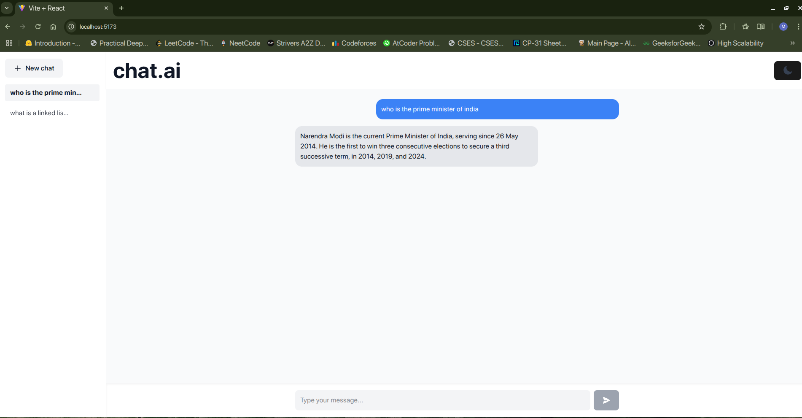
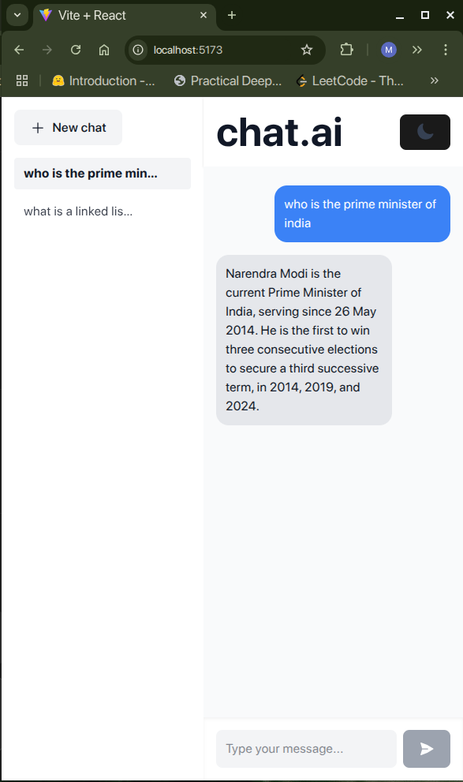
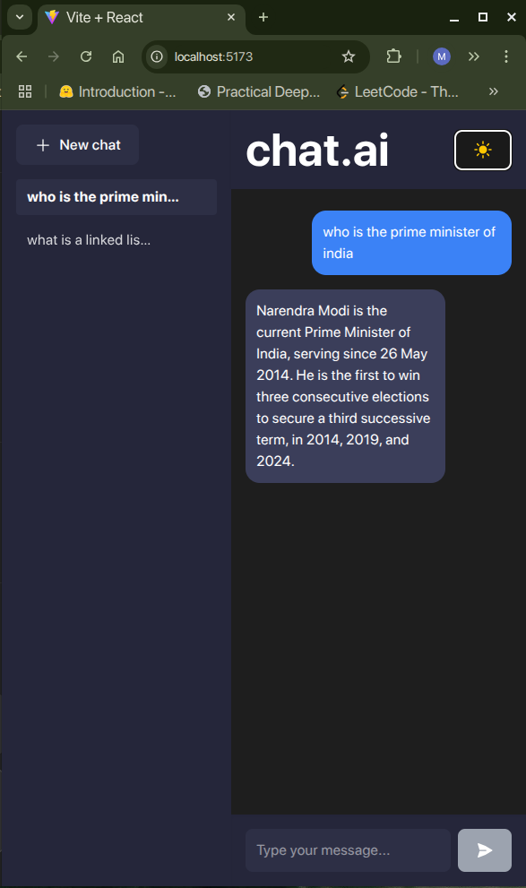
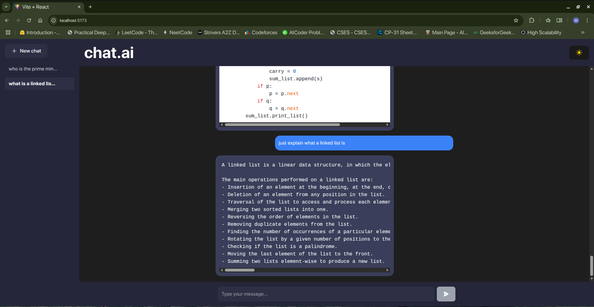
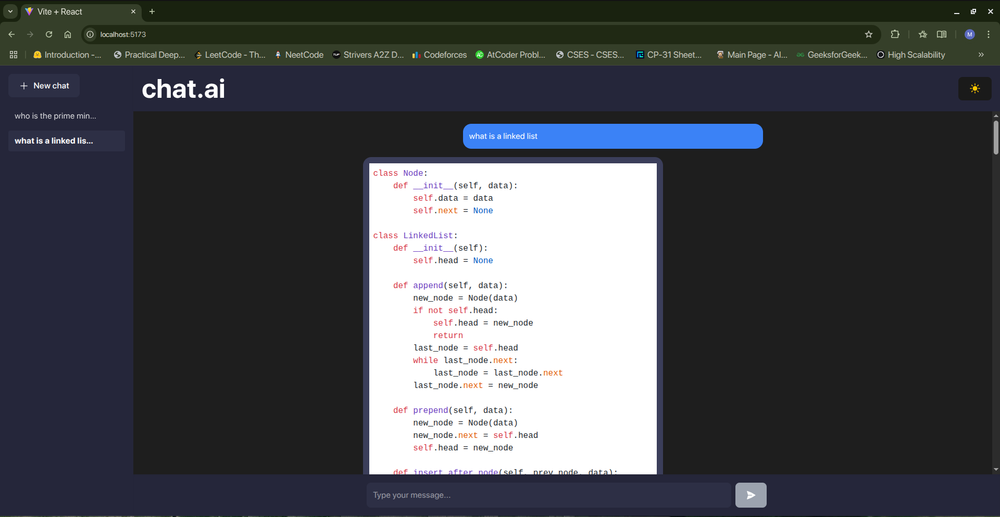

# 🌐 Web LLM Assistant

A full-stack AI assistant that intelligently answers your questions by:

* **Searching the web in real-time**
* **Scraping and extracting clean content**
* **Feeding it into a large language model**
* **Returning accurate and contextual answers**

Built using **Flask**, **React**, and **OpenRouter** (LLM API), this assistant mimics ChatGPT with features like session-based memory, markdown rendering, and a dark/light UI.

---

## 🔧 Project Structure

```
web-llm-assistant/
├── backend/              # Flask server
│   ├── app.py
│   └── requirements.txt
|   └── README.md
├── frontend/             # React + Tailwind client
│   ├── src/
│   │   └── App.jsx
│   └── README.md
├── README.md             # (this file)
```

---

## ✨ Features

* ✅ **Real-time web search** using DuckDuckGo
* ✅ **Web scraping** and readability optimization
* ✅ **LLM-powered answers** via OpenRouter (OpenAI-compatible API)
* ✅ **Session-based memory** per user
* ✅ **ChatGPT-like UI** with markdown and code formatting
* ✅ **Sidebar for previous sessions**
* ✅ **Dark/Light mode toggle**
* ✅ **Loading animation**

---

## 🧠 How It Works

### 1. Ask a Question

* Frontend sends your query and session ID to the Flask backend.

### 2. Web Scraping

* The backend searches the web and scrapes content from top results using `readability` and `BeautifulSoup`.

### 3. Prompt Construction

* It chunks the cleaned content and builds a system prompt including the web context.

### 4. LLM Query

* It sends the full message history + context to OpenRouter for a response.

### 5. Return + Save

* The assistant’s reply is returned to the frontend and stored in session memory.

---

## 🖥️ Frontend Setup

### 📁 Location: `frontend/`

#### 📦 Technologies:

* React
* Tailwind CSS
* Axios
* Framer Motion
* Heroicons
* React Markdown

#### ▶️ Start Dev Server:

```bash
cd frontend
npm install
npm run dev
```

Visit [http://localhost:5173](http://localhost:5173)

---

## 🖧 Backend Setup

### 📁 Location: `backend/`

#### 🐍 Technologies:

* Flask
* Flask-CORS
* OpenAI SDK (used for OpenRouter)
* Requests, BeautifulSoup4
* Readability-lxml
* Python-dotenv

#### ⚙️ Install + Run:

```bash
cd backend
pip install -r requirements.txt
python app.py
```

> 🔐 Create a `.env` file:

```
API_KEY=your-openrouter-api-key
```

Server runs on [http://localhost:5000](http://localhost:5000)

---

## 🔌 API Endpoints

### `POST /ask`

Ask a question and get an LLM response.

```json
{
  "session_id": "abc123",
  "query": "What is LangChain?"
}
```

### `GET /memory/<session_id>`

Retrieve memory for a session.

---

## 📦 requirements.txt

```txt
Flask
flask-cors
openai
beautifulsoup4
readability-lxml
requests
python-dotenv
```

---

## 📸 Screenshots







---

> Don’t forget to set your environment variables for production.

---

## 🧩 Future Enhancements

* Use PostgreSQL or Redis for persistent memory
* Add user login/auth
* Improve context selection with embeddings
* File upload support for document Q\&A
* Mobile-responsive improvements

---

## 📄 License

MIT License © 2025

---

## 📑 OpenRouter API Key Setup

To use the OpenRouter API for language model responses, you need to obtain an API key from [OpenRouter](https://openrouter.ai/).

### Steps to Get Your OpenRouter API Key:

1. Visit [OpenRouter](https://openrouter.ai/).
2. Sign up or log in to your account.
3. Navigate to the **API** section on your dashboard.
4. Copy your **API key**.

### Steps to Run the Application:

1. **Clone the repository:**

```bash
git clone https://github.com/your-repo/web-llm-assistant.git
cd web-llm-assistant
```

2. **Backend Setup:**

   * Navigate to the `backend/` directory:

   ```bash
   cd backend
   ```

   * Install the required Python dependencies:

   ```bash
   pip install -r requirements.txt
   ```

   * Create a `.env` file in the `backend/` directory with your OpenRouter API key:

   ```
   API_KEY=your-openrouter-api-key
   ```

   * Run the Flask server:

   ```bash
   python app.py
   ```

   The server will be running at [http://localhost:5000](http://localhost:5000).

3. **Frontend Setup:**

   * Navigate to the `frontend/` directory:

   ```bash
   cd frontend
   ```

   * Install the required Node.js dependencies:

   ```bash
   npm install
   ```

   * Run the React dev server:

   ```bash
   npm run dev
   ```

   The frontend will be running at [http://localhost:5173](http://localhost:5173).

Now, you can open both the frontend and backend in your browser and interact with the Web LLM Assistant!